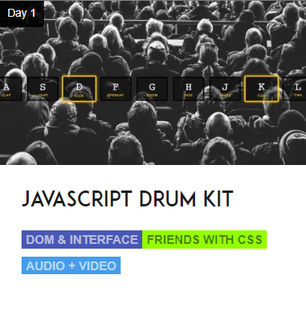

# what is this?

+ This is a 30 Day Vanilla JS Coding Challenge from <strong>Wes Bos!</strong>
https://javascript30.com/

+ Build 30 things in 30 days with 30 tutorials

+ No Frameworks × No Compilers × No Libraries × No Boilerplate

-------

 

 

 
 

